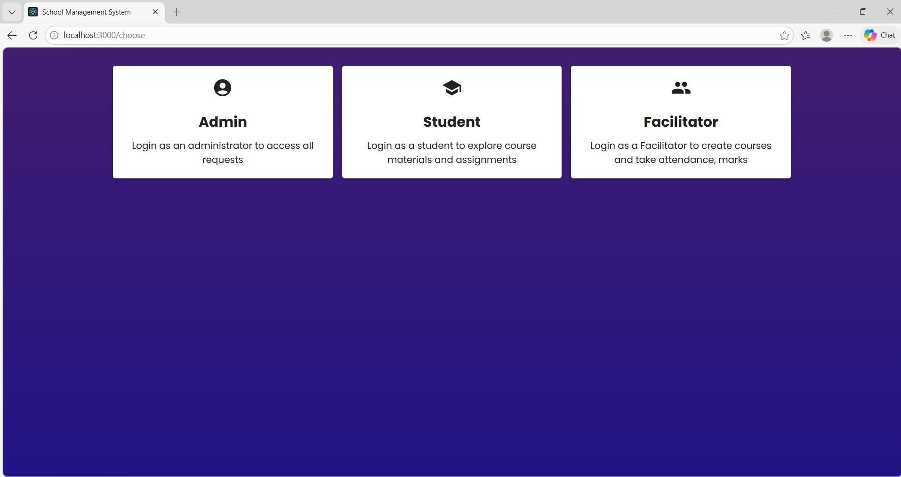

# 🎓 College Management System

A full-stack College Management System web application developed using Node.js, Express.js, MongoDB, HTML, CSS, and JavaScript.
This project is inspired from open-source implementations and further customized by me.

---

## 📌 Project Overview

The College Management System provides a centralized platform for administrators, faculty, and students to manage college operations efficiently and securely.

### 👨‍🎓 Students can:
- Register and login
- View profile information
- Check attendance
- View marks and results

### 👩‍🏫 Faculty can:
- Login securely
- Add and update attendance
- Upload marks
- Manage assigned subjects

### 🧑‍💼 Admin can:
- Manage students and faculty
- Add, update, and delete courses
- Assign subjects
- View system records

---

## 🚀 Features

- Secure authentication using JWT
- Password hashing using bcrypt
- Role-based access control
- RESTful APIs
- Responsive UI
- Modular backend architecture

---

## 🛠️ Tech Stack

| Layer | Technology |
|------|-----------|
| Frontend | HTML, CSS, JavaScript |
| Backend | Node.js, Express.js |
| Database | MongoDB |
| Tools | Git, GitHub, VS Code |

---


---

## ⚙️ Installation & Setup

### 1️⃣ Clone Repository

```bash
1️⃣ Clone Repository
git clone https://github.com/Divyanshu-500/College-Management-System-main.git


2️⃣ Backend Installation
cd backend
npm install


3️⃣ Configure Environment

Create .env file:
PORT=5000
MONGO_URI=your_mongodb_connection_string
JWT_SECRET=your_secret_key

4️⃣ Run Application
npm start


🌐 API Endpoints
| Method | Endpoint           | Description      |
| ------ | ------------------ | ---------------- |
| POST   | /api/auth/register | Register user    |
| POST   | /api/auth/login    | Login user       |
| GET    | /api/students      | Get all students |
| POST   | /api/attendance    | Add attendance   |
| POST   | /api/marks         | Upload marks     |


🔐 Security Features

Password hashing using bcrypt
Protected routes using middleware
Environment variables for sensitive data
Role-based authorization


📊 Database Design (Example)
Student Schema
{
  name: String,
  email: String,
  rollNumber: String,
  course: String,
  attendance: Number,
  marks: Object
}


🚀 Deployment Guide:

Deploy Backend (Render / Railway)-
Push code to GitHub
Connect repository to Render
Add environment variables
Deploy

Deploy Frontend-
Use Netlify
OR GitHub Pages


📈 Future Improvements-
Payment gateway integration
Notification system
PDF report generation
Cloud image upload
Docker containerization


🤝 Contribution Guidelines-
Fork the repository
Create a feature branch
Commit changes
Push branch
Create Pull Request


📊 Project Status-
🟢 Active Development


🧠 What I Learned-
REST API development
MongoDB schema modeling
Authentication & security
Git workflow
Error handling & debugging


## 📸 Screenshots

### Home Page


### Role Selection


### Admin Register


### Admin Login


### Student Login


👨‍💻 Author
Kajal Maurya
GitHub: https://github.com/thekajal06
